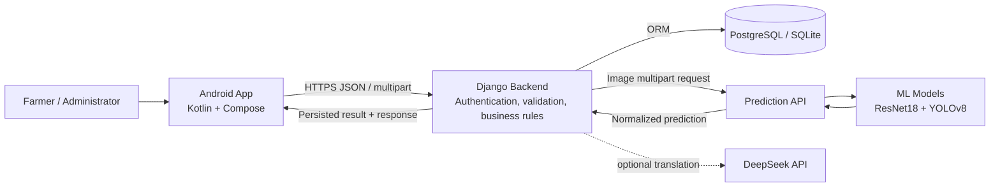
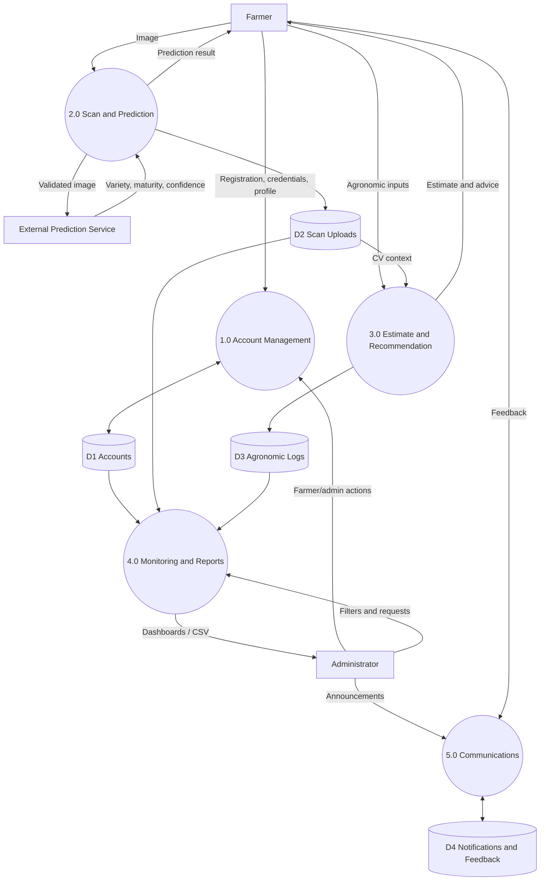
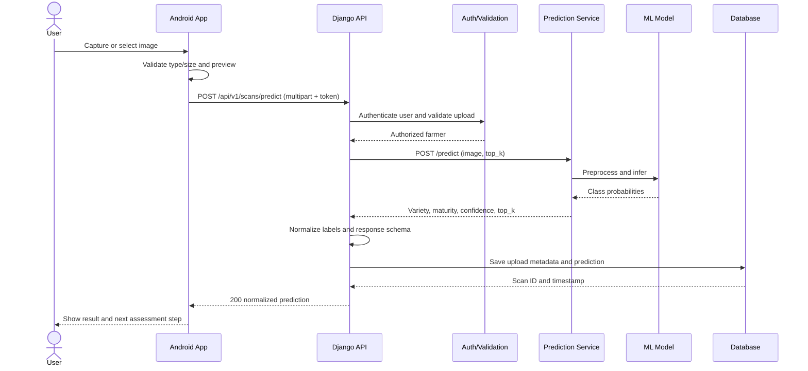

# Thesis Documentation Materials

## System architecture diagram

The current implementation uses a server-rendered web UI and Android WebView.
The Android node above represents the planned native client; Django remains the
backend reference and mediates all persistence and classifier access.

## Level-1 data-flow diagram

## Image-upload sequence diagram

Failure paths should return a structured error without creating a successful
scan record. Retries must be explicit so the same image is not silently stored
multiple times.

## Chapter 4 technical description

### System implementation

VISCANE was implemented as a Django-based information system that supports
farmer assessment and administrator monitoring workflows. The backend is
organized around a core Django application containing data models, request
handlers and reusable domain services. Django ORM provides database access,
while migrations define a repeatable schema for farmer accounts, administrator
accounts, scans, computer-vision uploads, agronomic logs, notifications,
feedback, audit records and system configuration. SQLite supports controlled
local demonstrations, and the configuration can use PostgreSQL through a
database URL for a shared deployment.

The current user interface is rendered with Jinja2 templates. A compatibility
helper maps the earlier Flask-style template URLs to Django routes, allowing the
existing visual design and workflows to remain stable during migration. Session
middleware maintains authenticated farmer and administrator sessions. Role
decorators restrict administrative and superadmin pages. The critical-security
revision preserves one-time first-administrator setup while requiring an
authenticated superadmin for subsequent privileged account creation and reset.
Deletion of scan images requires a CSRF-protected POST request.

### Computer-vision integration

For image assessment, the client uploads a sugarcane image to Django as
multipart form data. Django verifies the farmer session, forwards the image to a
separate prediction service, validates the returned JSON and normalizes the
variety and maturity labels. The verified service combines ResNet18 and YOLOv8
outputs and returns a ranked prediction. Django stores the upload metadata and
normalized result before displaying it. This boundary prevents the client from
directly controlling the classifier and provides one location for authorization,
schema normalization, audit logging and error handling.

The displayed percentage is the classifier's confidence for one image. It is
not the measured accuracy of the overall model. Model accuracy must be supported
by a labeled test set, a documented sampling procedure, class-wise metrics,
confusion matrices and an evaluation that is separate from training data.

### Agronomic estimation and recommendations

After image analysis, the farmer supplies structured agronomic factors such as
variety, cultivated area, plowing, weeding, fertilizer frequency, ratoon stage
and RSSI infection. The service normalizes these inputs and applies
variety-specific weights and baseline values. It returns estimated LKG/TC,
tonnage-related values and recommendations, then records the input and result in
the agronomic log. These outputs are decision-support estimates. Laboratory
testing and post-harvest weighing remain necessary for authoritative quality and
yield measurements.

### Verification and quality assurance

The local implementation was checked on Python 3.11.9 and Django 5.2.17. Django
system and migration checks passed, 25 automated tests passed, static files were
collected, and headless browser tests exercised registration, authentication,
farmer pages, administrator setup and farmer management. A live smoke test sent
a repository image through Django to the remote classifier, rendered the result,
and verified database and filesystem persistence. The test demonstrates system
integration; it does not validate the scientific correctness of the predicted
class.

### Native Android direction

The planned native client will use Kotlin, Jetpack Compose and MVVM with Clean
Architecture boundaries. Retrofit will communicate with a versioned Django JSON
API, Room will cache permitted data for offline viewing, Hilt will construct
dependencies, and coroutines will coordinate asynchronous work. CameraX and the
Photo Picker will replace WebView camera behavior. Django remains the system of
record and enforces every authorization decision; local Android role checks are
used only to select screens and navigation.

### Operational limitations

The development server is appropriate for thesis rehearsal on localhost but is
not a production server. A deployed system requires HTTPS, secure cookies,
restricted hosts, production WSGI/ASGI serving, protected secrets, static/media
storage, rate limiting, monitoring and rehearsed backup restoration. The remote
prediction endpoint currently uses plain HTTP and is a single external
dependency. A demonstration should therefore retain a local test image and a
documented fallback explanation for network outages.
